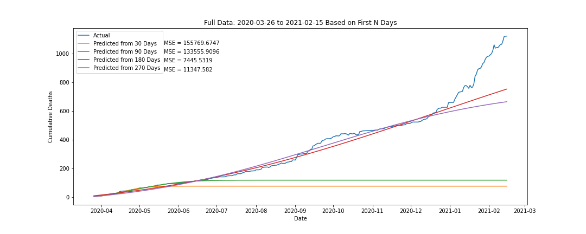

# IHME Covid Model

I recreated the COVID cumulative death rate model discussed in this [article](https://www.medrxiv.org/content/10.1101/2020.03.27.20043752v1.full).

Then, I fit the model using [data](https://raw.githubusercontent.com/CSSEGISandData/COVID-19/master/csse_covid_19_data/csse_covid_19_time_series/time_series_covid19_deaths_US.csv) on COVID deaths from Alameda county.

[covid_model.py](https://github.com/oliviamcnary/Covid-Model/blob/master/covid_model.py) contains the IHME model function, an optimizing nonlinear least-squares function, and unit tests for those functions.

[covid-modeling.ipynb](https://github.com/oliviamcnary/Covid-Model/blob/master/covid-modeling.ipynb) contains answers to questions about the IHME article and the fitted models.

Spoiler alert - it doesn't look good.
